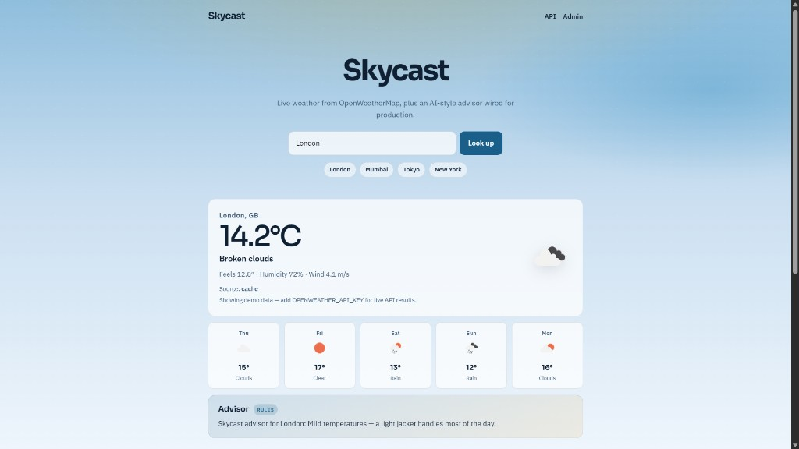
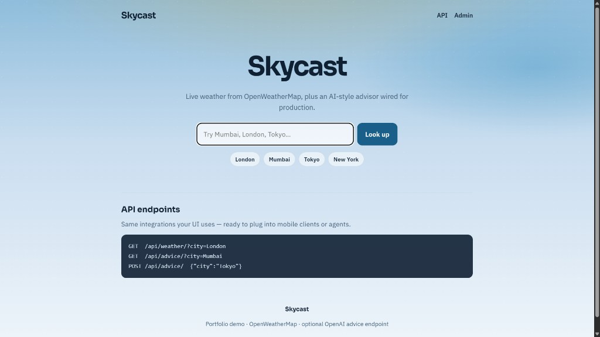

# Skycast

**Django weather API + lifestyle advisor** — OpenWeatherMap for live conditions, optional OpenAI for briefings, and a rules-based fallback so the app always works without paid keys.

Clone it, migrate, run — demo data works immediately. Drop in API keys when you want live weather and AI tips.

[](https://www.python.org/)
[](https://www.djangoproject.com/)
[](https://openweathermap.org/api)
[](https://platform.openai.com/)
[](LICENSE)



---

## What it does

| Surface | Behavior |
|---------|----------|
| **UI** (`/`) | Search a city → current weather, 5-day snapshot, advisor tip, recent lookup history |
| **`GET /api/weather/`** | Normalized JSON weather payload (live API, cache, or demo) |
| **`GET` / `POST /api/advice/`** | Weather fetch + advisor (`openai` or `rules`), with audit logging |

Built to show the full integration path recruiters care about: **external API → normalize → cache → optional AI → graceful fallback → JSON + UI**.

---

## Features

- **OpenWeatherMap** current weather + 5-day forecast (metric units)
- **Demo mode** when `OPENWEATHER_API_KEY` is missing — London, Mumbai, Tokyo, New York (and generic fallback for other cities)
- **Optional OpenAI** advisor; automatic **rules-based fallback** if the key is absent or the call fails
- **Response caching** (configurable TTL) to cut repeat API calls
- **Audit models** — `WeatherLookup` and `AdviceRequest` for demo footprint in Django admin
- **WhiteNoise + Gunicorn-ready** static serving for simple deploys
- **Clean Skycast UI** suited for screenshots and walkthroughs

---

## Quick start

**Requirements:** Python 3.10+

```bash
git clone https://github.com/TahaGabu/django-weather-api.git
cd django-weather-api

python -m venv .venv

# Windows (PowerShell)
.venv\Scripts\Activate.ps1

# macOS / Linux
source .venv/bin/activate

pip install -r requirements.txt

# Copy env template
copy .env.example .env          # Windows
# cp .env.example .env          # macOS / Linux

python manage.py migrate
python manage.py runserver
```

Open [http://127.0.0.1:8000](http://127.0.0.1:8000) and search a city. Demo mode works with no API keys.

---

## Configuration

Copy [`.env.example`](.env.example) → `.env` and adjust as needed:

| Variable | Required | Default | Description |
|----------|----------|---------|-------------|
| `SECRET_KEY` | Yes (prod) | insecure demo key | Django secret |
| `DEBUG` | No | `True` | Set `False` in production |
| `ALLOWED_HOSTS` | No | `localhost,127.0.0.1` | Comma-separated hosts |
| `OPENWEATHER_API_KEY` | No | _(empty)_ | Live weather; without it, demo data is used |
| `OPENAI_API_KEY` | No | _(empty)_ | AI advisor; without it, rules-based tips |
| `OPENAI_MODEL` | No | `gpt-4o-mini` | Chat Completions model |
| `WEATHER_CACHE_SECONDS` | No | `600` | Cache TTL for weather payloads |

### Live OpenWeatherMap

1. Get a free key: [openweathermap.org/api](https://openweathermap.org/api)
2. Set `OPENWEATHER_API_KEY=your_key_here` in `.env`
3. Restart the server (new keys can take a few minutes to activate)

### Optional OpenAI advisor

```env
OPENAI_API_KEY=sk-...
OPENAI_MODEL=gpt-4o-mini
```

Without a key (or if OpenAI errors), `/api/advice/` still returns practical tips from the rules engine.

---

## API reference

Base URL (local): `http://127.0.0.1:8000`

### `GET /api/weather/?city={city}`

```bash
curl "http://127.0.0.1:8000/api/weather/?city=London"
```

**200 example**

```json
{
  "city": "London",
  "country": "GB",
  "temp": 14.2,
  "feels_like": 12.8,
  "humidity": 72,
  "wind_speed": 4.1,
  "condition": "Broken clouds",
  "icon": "04d",
  "icon_url": "https://openweathermap.org/img/wn/04d@2x.png",
  "forecast": [
    { "day": "2026-07-17", "temp": 15, "condition": "Clouds", "icon": "03d" }
  ],
  "source": "openweather",
  "demo_note": ""
}
```

`source` may be `openweather`, `demo`, or `cache`.

| Status | When |
|--------|------|
| `400` | Missing `city` |
| `502` | Upstream OpenWeather failure / city not found (live mode) |

### `GET /api/advice/?city={city}`

```bash
curl "http://127.0.0.1:8000/api/advice/?city=Mumbai"
```

### `POST /api/advice/`

```bash
curl -X POST "http://127.0.0.1:8000/api/advice/" \
  -H "Content-Type: application/json" \
  -d "{\"city\":\"Tokyo\"}"
```

**200 example**

```json
{
  "city": "Tokyo",
  "mode": "rules",
  "advice": "Skycast advisor for Tokyo: Mild temperatures — a light jacket handles most of the day. Clear skies: UV exposure can still be high — sunscreen helps midday.",
  "weather": {
    "temp": 22.0,
    "condition": "Clear sky",
    "humidity": 55
  }
}
```

`mode` is `openai` or `rules`.

---

## Architecture

```text
Browser / curl
      │
      ▼
 Django views (UI + JSON)
      │
      ▼
 weather.services
      ├─ fetch_weather()     → cache → OpenWeather (or demo)
      └─ generate_advice()   → OpenAI (or rules fallback)
      │
      ▼
 SQLite models (lookup + advice audit)
```

**Design choices that matter in interviews:**

1. **Normalized payloads** — clients never see raw OpenWeather shapes  
2. **Fail soft** — missing keys never brick the demo  
3. **Cache before network** — hash-keyed city cache with TTL  
4. **Audit trail** — every lookup/advice call can be inspected in admin  

---

## Project structure

```text
django-weather-api/
├── config/                 # Settings, root URLs, WSGI/ASGI
├── weather/
│   ├── models.py           # WeatherLookup, AdviceRequest
│   ├── services.py         # OpenWeather + OpenAI + demo/rules
│   ├── views.py            # UI + API endpoints
│   ├── urls.py
│   └── admin.py
├── templates/weather/      # Skycast UI
├── static/                 # CSS / JS
├── manage.py
├── requirements.txt
├── .env.example
└── LICENSE
```

---

## Tech stack

| Layer | Choice |
|-------|--------|
| Backend | Django 5 |
| Weather | OpenWeatherMap Current + 5-day Forecast |
| Advisor | OpenAI Chat Completions (optional) + rules fallback |
| HTTP | `requests` |
| Config | `python-dotenv` |
| Cache | Django local-memory cache |
| Static | WhiteNoise |
| Prod server | Gunicorn (in requirements) |
| DB (dev) | SQLite |

---

## Demo cities (no API key)

| City | Notes |
|------|--------|
| London | Demo GB profile |
| Mumbai | Demo IN profile |
| Tokyo | Demo JP profile |
| New York | Demo US profile |
| Any other | Generic demo payload with the city name you typed |

---

## Screenshots

### Result — weather, 5-day forecast, rules advisor


### Home — search, quick cities, API endpoints



---

## Deploy notes (optional)

Suitable for a simple PaaS (Railway, Render, Fly.io):

1. Set `DEBUG=False`, a strong `SECRET_KEY`, and your host in `ALLOWED_HOSTS`
2. Set `OPENWEATHER_API_KEY` (and optionally `OPENAI_API_KEY`)
3. Run `migrate` on boot; serve with Gunicorn + WhiteNoise (already wired)

A live URL in the README header beats screenshots alone.

---

## Why this is a strong portfolio project

Weather apps are common — the **differentiators** here are intentional:

- Real third-party API integration with timeout / error handling  
- Optional AI layer that **degrades cleanly** (not “AI or nothing”)  
- Public JSON API alongside a polished UI  
- Caching + persistent audit models (production-minded glue)  
- Zero-friction local run for reviewers (demo mode)

Talk about it as: *“I wired APIs, shaped a stable contract, and kept the product usable when vendors fail.”*

---

## License

[MIT](LICENSE) — free to use in interviews, forks, and demos.
